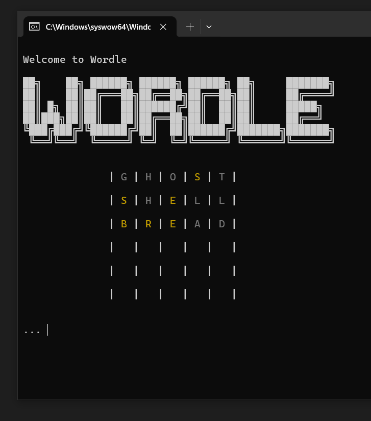

# CMD Wordle



## Description
This a project I made during the programming 1 course at [NTI Gymnasiet Uppsala](https://github.com/NTIG-Uppsala/). It's a completely text based version of the New York Times game Wordle. The game is played in the terminal and the player has 6 guesses to guess a 5 letter word. After each guess the player is given feedback on how many letters are correct via colors.

## Installation
### Prerequisites
- Python 3
- pip

### Instructions
1. Clone the repository
2. Install dependencies:
```bash
pip install termcolor
```
3. Run the game:
```bash
python ./main.py
```

## Technologies
- Python
- CSV data storage